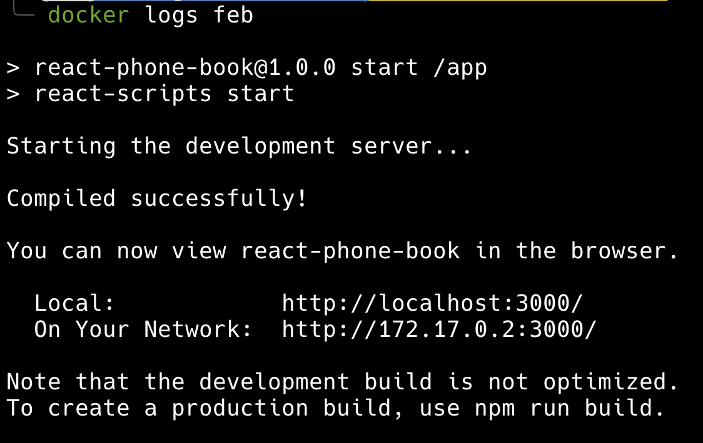
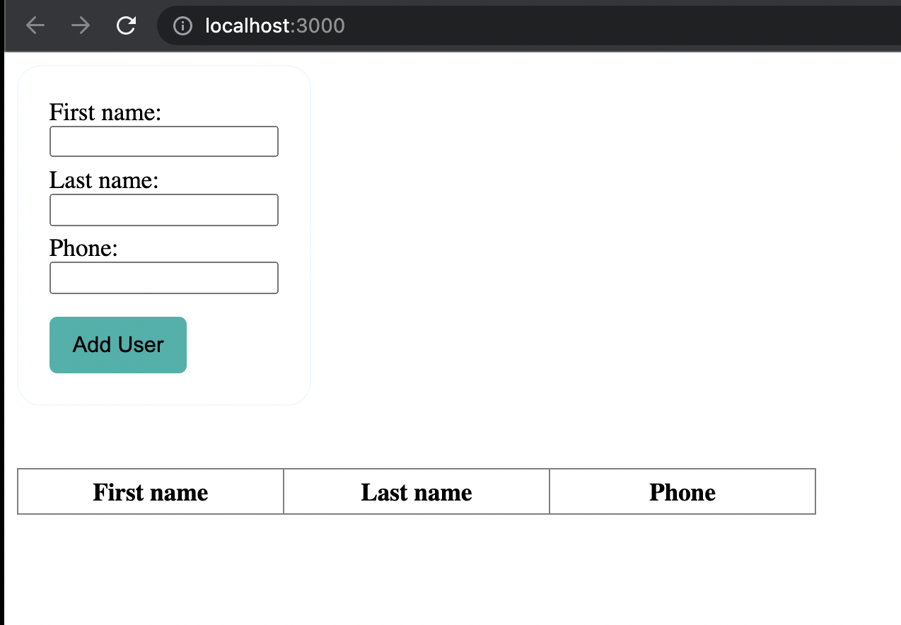
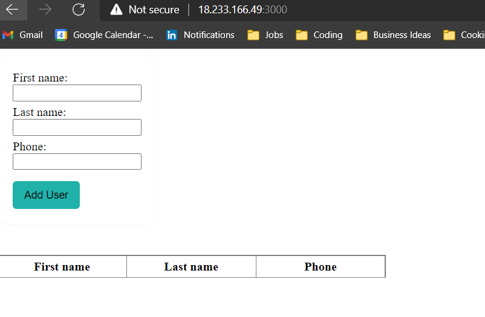

# ohannas - Coderbyte Task
The project aims to create a phonebook application with using React and deploy it as a web application with Docker engine.
 
Configured a Dockerfile
Port set and run as 3000 in Dockerfile to expose from local or VM.
index.html file created.

## Pre-requisities
Docker Eengine must be installed and run where you run the NodeJS application.
Port 3000 should be open (Ex: from Security Group on the instance)

## Deployment Steps
```
git clone https://github.com/redkit7ca/ohanna.git
docker build -t ohanna .
docker run -dp 3000:3000 ohanna
```
docker ps -a   ==> List the containers

docker logs containerid


Open browser and copy the instance IP/localhost and port.
(Ex:For local host http://localhost:3000)



Deployed to cloud


Note: Database part could not completed because of the time limit.